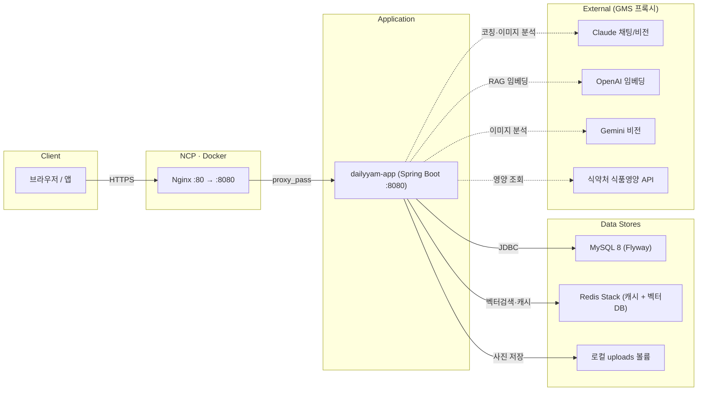

# dailyYam - AI 식단 관리 웹 서비스

 AI 기반 식단 관리 서비스 — 식단 사진을 기록하면 AI가 영양을 분석·평가하고,
> 질환 맞춤 코칭과 챌린지로 건강한 식습관을 유도한다.

---

## 1. 개발 결과 — 핵심 기술 및 구현 내용

### 1.1 서비스 개요
**dailyYam**은 사용자가 식단 사진을 기록하면 AI가 영양을 분석·점수화하고,
질환 맞춤형 AI 코칭과 챌린지를 통해 건강한 식습관을 유도하는 식단 관리 서비스다.

### 1.2 핵심 기능
- **식단 기록 + AI 비전 분석**: 음식 사진 업로드 → Claude/Gemini Vision으로 음식·영양 추정
- **식단 점수화**: 목표 대비(goal)·질환 적합(condition)·영양 균형(balance) 가중 평균으로 끼니별 점수 산출
- **음식 검색**: 식약처 영양 DB 실시간 연동 + Redis 캐시 + 관련도순 정렬
- **AI 코치(RAG + Tool Calling)**: 질환 가이드 문서를 벡터 검색해 근거로 주입하고,
  사용자의 실제 식단/질환은 도구 호출로 가져와 개인화 답변 생성
- **챌린지 + 레벨 시스템**: 코치가 "N점 M일 연속" 챌린지 생성, 성공 시 경험치/레벨 부여(게이미피케이션)
- **통계/추세**: 기간별 영양·점수 추이, 체중·BMI 대시보드

### 1.3 핵심 기술 스택
- **Backend**: Java 21, Spring Boot 3, Spring Security(JWT), MyBatis
- **DB / Cache**: MySQL 8 (+ Flyway 스키마 버전관리), Redis Stack(RediSearch — 캐시 + 벡터 스토어)
- **AI**: Spring AI — Anthropic Claude(채팅/비전), OpenAI `text-embedding-3-small`(임베딩),
  Google Gemini(비전 옵션) — 전량 SSAFY **GMS 프록시** 경유
- **Infra**: Docker / Docker Compose, Nginx(리버스 프록시), **NCP**(네이버 클라우드) 배포
- **Docs**: SpringDoc(Swagger UI)

---

## 2. 개발 환경과 전체 시스템 구조도

### 2.1 개발 / 배포 환경
- **빌드**: Gradle, 런타임 이미지 `eclipse-temurin:21` (멀티스테이지 Dockerfile)
- **컨테이너 오케스트레이션**: Docker Compose (`app`, `mysql`, `redis` 3개 서비스 + healthcheck/볼륨)
- **배포**: NCP 서버의 Docker 환경, **Nginx가 80포트 → 8080(앱) 리버스 프록시**
- **형상관리**: Git, DB 스키마는 Flyway 마이그레이션(V1~V13)으로 코드와 함께 버전관리

### 2.2 전체 시스템 구조도



- 컨테이너 간 통신은 Compose 네트워크 서비스명(`mysql`, `redis`)으로 연결,
  `app`은 DB·Redis가 `healthy` 된 뒤 기동
- 업로드 사진은 호스트 볼륨(`./uploads`)에 영속화, `/uploads/**` 정적 서빙
- 외부 AI/API 호출은 전량 SSAFY GMS 프록시(`gms.ssafy.io`) 경유

---

## 3. 적용 패턴 및 핵심 알고리즘

### 3.1 아키텍처 패턴
- **도메인형 레이어드 아키텍처**: `domain/{기능}/{controller, service, mapper, dto, entity}` 로 기능별 응집
- **공통 응답 래퍼**: `ApiResponse<T>`(`success`/`data`/`error`)로 일관된 API 계약,
  `GlobalExceptionHandler` + `ErrorCode` Enum으로 예외 중앙 처리
- **JWT 무상태 인증 + 역할 기반 접근제어(RBAC)**: `hasRole`로 챌린지 생성=COACH, RAG 재색인=ADMIN 전용
- **외부 의존성 폴백(Fallback)**: 식약처 키 미설정/오류 시 로컬 검색으로,
  벡터스토어 미구성 시 RAG 비활성으로 graceful degradation
- **마이그레이션 기반 스키마 관리(Flyway)**: 변경분을 신규 버전 추가만으로 환경 간 동일 스키마 보장

### 3.2 핵심 알고리즘

**1) RAG (검색 증강 생성)**
- 가이드 문서 → 토큰 청킹 → OpenAI 임베딩 → Redis 벡터 인덱스(`dailyyam-guides`) 적재
- 질문도 임베딩해 코사인 유사도 top-K 검색 → 근거를 프롬프트에 주입 → Claude 답변
- 재색인 시 직전 청크 ID를 보관 후 삭제(지우고 다시 넣기)하여 중복 방지

**2) Tool Calling 기반 개인화**
- 일반 지식은 RAG로, 사용자의 실제 식단·질환은 모델이 필요 시 `CoachTools`를 호출해 DB에서 조회
- 환각 없이 개인 데이터를 반영한 코칭 답변 생성

**3) 식단 점수 가중 평균**
- 끼니별 `goal · condition · balance` 점수를 칼로리 가중으로 종합해 일별 종합 점수 산출

**4) 챌린지 연속 달성(streak) + 멱등 보상**
- `meal_logs` + `diet_scores`로 날짜별 평균 점수를 계산, **달력상 연속일**을 판정(미기록일은 연속 끊김)
- 성공 시 경험치 지급은 `user_challenge_completions`의 **UNIQUE 제약**으로 멱등 처리(중복 지급 차단)

**5) 음식 검색 — 전체 페이지 수집 + 관련도순 정렬**
- 식약처 API를 전 페이지 수집(안전 상한 1000건) → **정확일치 → 앞부분일치 → 부분포함** 순 정렬
- Redis 캐시(키워드 단위, 0건은 미캐싱)로 응답 속도 확보

---

## 4. 활용 데이터셋

| 구분 | 데이터셋 | 출처 / 형식 | 용도 |
|------|----------|------------|------|
| **1. 식품 영양 DB** | 식품의약품안전처 **식품영양성분 데이터베이스**(`FoodNtrCpntDbInfo02`) | 공공데이터포털 Open API(JSON) | 음식 검색·영양성분(칼로리/탄단지/나트륨) 조회 |
| **2. 질환별 식이 가이드 코퍼스** | 자체 구축 가이드 6종(당뇨·고혈압·이상지질혈증·신장질환·비만·빈혈) + 일반 균형식 | 공인 의학 출처 기반 자체 작성 Markdown | AI 코치 RAG 검색 근거 |
| **3. 사용자 생성 데이터** | 식단 기록·사진·점수·목표 | 서비스 내 누적(MySQL) | 통계/추세·챌린지 진행률·AI 코치 개인화 |

> 음식 영양 정보는 **식품의약품안전처 식품영양성분 DB(공공데이터포털 Open API)** 를 실시간 연동해
> 확보하며, 응답을 정규화해 로컬 캐시(`foods`)에 적재한다. AI 코치 답변의 신뢰성을 위해
> **당뇨·고혈압 등 6개 질환의 식이 가이드를 공인 출처 기반으로 직접 구축**해 RAG 코퍼스로 사용했다.
> 그 외 사용자의 식단·점수 데이터는 서비스 이용 과정에서 누적되어 통계·챌린지·개인화 코칭에 활용된다.

---

## 5. AI 사용 보고서

### 5.1 서비스 기능에서의 AI 활용

| 기능 | 사용 모델 | 방식 |
|------|-----------|------|
| 식단 사진 분석 | Claude Vision(기본) / Gemini(옵션) | 이미지 → 음식·영양 추정 |
| AI 영양 코치 | Claude (opus 4.8) | RAG + Tool Calling 대화 |
| 가이드 의미 검색 | OpenAI `text-embedding-3-small` | 임베딩 → Redis 벡터 검색 |

- 모든 LLM 호출은 SSAFY **GMS 프록시**를 경유(키 중앙관리·과금 일원화)
- 벡터스토어/AI 키 미설정 시에도 앱이 정상 기동되도록 **선택적 주입(optional injection)** 으로 설계

### 5.2 개발 과정에서의 AI 활용 (Claude Code)

코드 어시스턴트(Claude Code)를 통해 기능 구현과 트러블슈팅을 가속했다. 대표 프롬프트:

- "about_challenge.md 보고 챌린지 기능 구현하자"
  → 마이그레이션·도메인(엔티티/매퍼/서비스/컨트롤러)·권한까지 일괄 구현
- "코치가 챌린지 성공 시 경험치 주는데 중복 지급을 어떻게 막지?"
  → 완료 이력 테이블 + UNIQUE 멱등 패턴 도출
- "음식 검색이 전체 페이지에서 안 된다"
  → 전 페이지 수집 + 관련도순 정렬로 리팩터링
- "시스템 아키텍처 다이어그램 만들어줘"
  → 전체 구조도 작성
- DB 시드/한글 인코딩/Docker·MySQL 운영 이슈 트러블슈팅 보조

> AI는 **서비스 기능(비전 분석·RAG 코칭·임베딩 검색)** 과 **개발 생산성(코드 생성·리팩터링·트러블슈팅)**
> 양면에서 활용되었다. 특히 코드 어시스턴트를 통해 도메인 단위 기능을 신속히 구현하고,
> RAG·멱등 보상 등 핵심 설계 의사결정을 함께 검토했다.

## 기술 스택

### Frontend
- **Vue 3** (Composition API + `<script setup>`)
- **TypeScript**
- **Tailwind CSS v4** (Vite 플러그인)
- **Pinia** — 전역 상태 관리 (인증)
- **Vue Router 4** — SPA 라우팅 + Navigation Guard
- **Chart.js + vue-chartjs** — 주간 칼로리 차트
- **Lucide Vue** — 아이콘

### Backend
- **Spring Boot API** via Vite proxy
- **SSAFY GMS 게이트웨이 → OpenAI gpt** — `gpt-4o-mini`(비전 식단 분석) / `gpt-5-mini`(AI 코치)
- **In-memory DB** — 런타임 상태 저장 (재시작 시 초기화)

### Build & Dev
- **Vite 6** — 프론트엔드 번들러 / HMR
- **Vite preview** — production build preview

---

## 프로젝트 구조

```
dailyYam_front/
├── src/
│   ├── main.ts                  # 앱 진입점 / 라우터 / Pinia 초기화
│   ├── App.vue                  # 루트 컴포넌트
│   ├── types.ts                 # 공통 타입 정의
│   ├── stores/
│   │   ├── auth.ts              # 인증 스토어 (Pinia)
│   │   └── meal.ts              # 식단 스토어 (Pinia)
│   ├── components/
│   │   ├── Sidebar.vue          # 사이드바 (회원/코치 모드 분기)
│   │   ├── Header.vue           # 상단 헤더
│   │   ├── AuthLayout.vue       # 인증 페이지 공통 레이아웃
│   │   ├── FieldInput.vue       # 폼 입력 컴포넌트
│   │   └── Toggle.vue           # 토글 컴포넌트
│   └── views/
│       ├── LandingView.vue      # 랜딩 페이지
│       ├── LoginView.vue        # 로그인 (회원/코치 탭)
│       ├── OnboardingView.vue   # 회원가입
│       ├── PasswordResetView.vue
│       ├── DashboardView.vue    # 메인 대시보드
│       ├── MealLogView.vue      # AI 식단 기록
│       ├── MealHistoryView.vue  # 식단 이력
│       ├── MealDetailView.vue   # 식단 상세
│       ├── AiInsightsView.vue   # AI 인사이트 & 목표
│       ├── ChatView.vue         # 코치 채팅 (회원)
│       ├── CoachChatView.vue    # 회원 채팅 (코치)
│       ├── CoachDashboardView.vue
│       ├── CoachMembersView.vue
│       ├── NotificationsView.vue
│       ├── SettingsView.vue
│       └── ProfileEditView.vue
├── vite.config.ts
├── tsconfig.json
├── package.json
├── index.html
├── .env                         # 환경 변수 (gitignore)
└── .env.example                 # 환경 변수 예시
```

---

## API 엔드포인트

| 메서드 | 경로 | 설명 |
|--------|------|------|
| `GET` | `/api/dashboard` | 식단 목록, 일일 목표, 사용자 통계 조회 |
| `POST` | `/api/meals` | 새 식단 기록 추가 |
| `PUT` | `/api/goals` | 일일 영양 목표 수정 |
| `PUT` | `/api/stats` | 체중·BMI·달성률 업데이트 |
| `POST` | `/api/meals/analyze` | 음식 사진 → AI 비전(gpt-4o-mini) 영양 분석 |
| `POST` | `/api/calories/estimate` | 음식명 + 중량 → 칼로리 추정 |
| `GET` | `/api/chats` | 코치 채팅방 목록 조회 |
| `POST` | `/api/chats/:coachId/messages` | 코치에게 메시지 전송 (AI 코치 응답) |

---

## 시작하기

### 요구사항
- Node.js 18+
- SSAFY GMS Key (선택 — 없으면 Mock 데이터로 동작)

### 설치

```bash
npm install
```

### 환경 변수 설정

`.env.example`을 복사하여 `.env` 파일을 생성합니다.

```bash
cp .env.example .env
```

`.env` 파일에 GMS Key를 입력합니다.

```env
GMS_KEY="your_gms_key_here"
APP_URL="http://localhost:3000"
```

> **GMS Key가 없어도 동작합니다.** 이미지 분석 및 AI 코치 기능이 미리 정의된 Mock 데이터로 응답합니다.

### 개발 서버 실행

```bash
npm run dev
```

브라우저에서 [http://localhost:3000](http://localhost:3000) 접속

### 프로덕션 빌드

```bash
npm run build
npm start
```

---

## 인증 구조

- 인증 상태는 **localStorage** 기반으로 관리 (`dailyyam_auth`, `dailyyam_role`, `dailyyam_name`)
- **회원 / 코치** 두 가지 역할을 지원하며, 로그인 시 선택
- Navigation Guard가 비인증 사용자를 `/login`으로 리다이렉트

**공개 경로 (인증 불필요)**
```
/  /landing  /login  /password-reset  /onboarding
```

---

## 데이터 타입

```typescript
interface Meal {
  id: string;
  time: string;           // "HH:MM"
  mealType: string;       // "아침" | "점심" | "저녁" | "간식"
  foodName: string;
  calories: number;
  protein: number;        // g
  carbs: number;          // g
  fat: number;            // g
  tags: string[];
  imageUrl: string;
  items?: MealItem[];     // 세부 구성 항목
  loggedAt: string;       // ISO 8601
}

interface DailyGoals {
  targetCalories: number;
  targetProtein: number;
  targetCarbs: number;
  targetFat: number;
}

interface UserStats {
  currentWeight: number;
  previousWeight: number;
  bmi: number;
  progressRate: number;   // %
}
```

---

## 스크립트

| 명령어 | 설명 |
|--------|------|
| `npm run dev` | 개발 서버 시작 (Vite HMR) |
| `npm run build` | 프론트엔드 빌드 + 서버 번들링 |
| `npm start` | 프로덕션 서버 시작 |
| `npm run lint` | TypeScript 타입 검사 |
| `npm run clean` | dist 폴더 삭제 |
