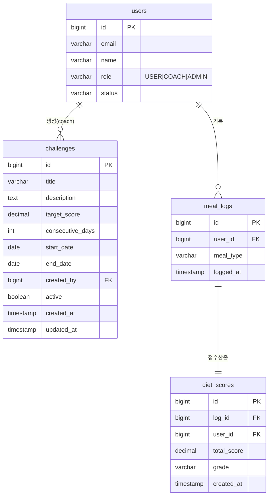

# dailyYam 챌린지 MVP 구현안

> 3시간 안에 백엔드와 프론트엔드를 함께 구현하기 위한 최소 기능 설계.  
> 범용 챌린지 룰 엔진이 아니라 **"일별 점수 N점 이상 M일 연속 달성"** 한 가지 형식만 지원한다.

---

## 1. 목표

챌린지 기능은 사용자가 식단 기록과 점수 확인을 꾸준히 반복하도록 만드는 동기 부여 기능이다. MVP에서는 코치가 챌린지를 생성하고, 모든 일반 사용자가 동일한 챌린지를 조회한다.

### 핵심 정책

- 챌린지는 `COACH` 모드에서만 생성한다.
- 챌린지 대상은 모든 일반 사용자다.
- 별도 참여 신청은 만들지 않는다.
- 챌린지 성공 조건은 하나로 고정한다.
- 사용자별 진행률은 별도 테이블에 저장하지 않고 조회 시 즉시 계산한다.

### 고정 챌린지 형식

```txt
일별 점수 {targetScore}점 이상 {consecutiveDays}일 연속 달성 시 성공
```

예:

```txt
일별 점수 90점 이상 3일 연속 달성 시 챌린지 성공
```

---

## 2. 구현 범위

### 포함

- 코치 모드 챌린지 생성
- 일반 사용자 챌린지 목록 조회
- 챌린지별 내 현재 연속 달성 일수 표시
- 성공 여부 표시
- 챌린지 카드 UI

### 제외

- 사용자별 챌린지 참여 테이블
- 참여하기/취소하기
- 배지 저장
- 랭킹
- 알림
- 스케줄러
- 여러 종류의 룰
- 관리자 승인

---

## 3. ERD

MVP에서는 신규 테이블을 `challenges` 1개만 추가한다. 사용자별 진행 상태는 `meal_logs`와 `diet_scores`를 조회해서 계산한다.



---

## 4. DB 테이블

```sql
CREATE TABLE challenges (
  id BIGINT AUTO_INCREMENT PRIMARY KEY,
  title VARCHAR(100) NOT NULL,
  description TEXT,
  target_score DECIMAL(5,2) NOT NULL,
  consecutive_days INT NOT NULL,
  start_date DATE NOT NULL,
  end_date DATE NOT NULL,
  created_by BIGINT NOT NULL,
  active BOOLEAN NOT NULL DEFAULT TRUE,
  created_at TIMESTAMP DEFAULT CURRENT_TIMESTAMP,
  updated_at TIMESTAMP DEFAULT CURRENT_TIMESTAMP ON UPDATE CURRENT_TIMESTAMP,
  CONSTRAINT fk_challenges_created_by
    FOREIGN KEY (created_by) REFERENCES users(id)
);
```

사용자 레벨은 별도 테이블을 만들지 않고 `users` 테이블에 직접 컬럼을 추가한다.

```sql
ALTER TABLE users
ADD COLUMN level INT NOT NULL DEFAULT 1,
ADD COLUMN exp INT NOT NULL DEFAULT 0,
ADD COLUMN completed_challenge_count INT NOT NULL DEFAULT 0;
```

### 필드 설명

| 컬럼 | 설명 |
|------|------|
| `title` | 챌린지 제목 |
| `description` | 상세 설명 |
| `target_score` | 일별 기준 점수. 예: 90 |
| `consecutive_days` | 연속 달성 일수. 예: 3 |
| `start_date` | 시작일 |
| `end_date` | 종료일 |
| `created_by` | 생성한 코치 ID |
| `active` | 노출 여부 |

### 사용자 레벨 필드 설명

| 컬럼 | 설명 |
|------|------|
| `level` | 현재 사용자 레벨. 기본값 1 |
| `exp` | 누적 경험치 |
| `completed_challenge_count` | 완료한 챌린지 수 |

### 레벨 정책

MVP에서는 챌린지 성공 시 고정 경험치를 지급한다.

```txt
챌린지 성공 1회 = 경험치 +100
챌린지 성공 1회 = completed_challenge_count +1
```

레벨은 누적 경험치 기준으로 계산한다.

| 레벨 | 필요 누적 경험치 |
|------|------------------|
| Lv.1 | 0 이상 |
| Lv.2 | 300 이상 |
| Lv.3 | 700 이상 |
| Lv.4 | 1200 이상 |
| Lv.5 | 2000 이상 |

예:

```txt
exp = 340이면 Lv.2
exp = 750이면 Lv.3
```

레벨 계산은 백엔드에서 처리하고, 프론트는 API 응답값을 표시한다.

---

## 5. API 목록

### 5.1 챌린지 생성

```txt
POST /api/challenges
```

권한:

- `COACH`만 가능

Request:

```json
{
  "title": "90점 3일 연속 챌린지",
  "description": "일별 식단 점수 90점 이상을 3일 연속 달성해보세요.",
  "targetScore": 90,
  "consecutiveDays": 3,
  "startDate": "2026-06-25",
  "endDate": "2026-07-02"
}
```

Response:

```json
{
  "success": true,
  "data": {
    "id": 1
  }
}
```

### 5.2 챌린지 목록 조회

```txt
GET /api/challenges
```

권한:

- `USER`, `COACH` 모두 조회 가능
- 일반 사용자는 본인 진행률 포함
- 코치는 진행률 없이 생성된 챌린지 목록만 보여줘도 MVP에서는 충분함

Response:

```json
{
  "success": true,
  "data": [
    {
      "id": 1,
      "title": "90점 3일 연속 챌린지",
      "description": "일별 식단 점수 90점 이상을 3일 연속 달성해보세요.",
      "targetScore": 90,
      "consecutiveDays": 3,
      "currentStreak": 2,
      "success": false,
      "rewardExp": 100,
      "startDate": "2026-06-25",
      "endDate": "2026-07-02",
      "active": true
    }
  ]
}
```

### 5.3 사용자 레벨 조회

사용자 레벨 정보는 별도 API를 새로 만들기보다 기존 사용자 정보 또는 대시보드 응답에 포함하는 방식을 권장한다.

권장 1: `GET /api/users/me`

```json
{
  "success": true,
  "data": {
    "id": 1,
    "email": "example@ssafy.com",
    "name": "ssafy15",
    "role": "USER",
    "status": "ACTIVE",
    "heightCm": 167,
    "weightKg": 73.5,
    "level": 2,
    "exp": 340,
    "completedChallengeCount": 3
  }
}
```

권장 2: `GET /api/dashboard`

```json
{
  "success": true,
  "data": {
    "userStats": {
      "currentWeight": 73.5,
      "previousWeight": 74.0,
      "bmi": 26.3,
      "progressRate": 72,
      "level": 2,
      "exp": 340,
      "completedChallengeCount": 3
    }
  }
}
```

프론트에서는 마이페이지와 챌린지 페이지에서 `level`, `exp`, `completedChallengeCount`를 표시한다.

---

## 6. 진행률 계산 방식

사용자별 진행 상태 테이블을 만들지 않는다. 챌린지 조회 시 `meal_logs`와 `diet_scores`로 날짜별 평균 점수를 계산한다.

### 날짜별 점수 조회 SQL

```sql
SELECT
  DATE(m.logged_at) AS day,
  AVG(s.total_score) AS daily_score
FROM meal_logs m
JOIN diet_scores s ON s.log_id = m.id
WHERE m.user_id = #{userId}
  AND DATE(m.logged_at) BETWEEN #{startDate} AND #{endDate}
GROUP BY DATE(m.logged_at)
ORDER BY day;
```

### Java 계산 로직

```java
int currentStreak = 0;
int maxStreak = 0;

for (DailyScoreRow row : dailyScores) {
    if (row.getDailyScore().compareTo(challenge.getTargetScore()) >= 0) {
        currentStreak++;
        maxStreak = Math.max(maxStreak, currentStreak);
    } else {
        currentStreak = 0;
    }
}

boolean success = maxStreak >= challenge.getConsecutiveDays();
```

MVP에서는 `currentStreak`를 화면 진행률로 사용한다. 더 정확히 하려면 `maxStreak`를 함께 반환해도 된다.

### 챌린지 성공 시 레벨 갱신

챌린지 성공 여부를 계산한 뒤, 이전에 성공 처리되지 않았던 챌린지가 새로 성공 상태가 되면 사용자 레벨 정보를 갱신한다.

```java
if (!alreadyCompleted && success) {
    user.completedChallengeCount += 1;
    user.exp += 100;
    user.level = calculateLevel(user.exp);
}
```

레벨 계산 예시:

```java
int calculateLevel(int exp) {
    if (exp >= 2000) return 5;
    if (exp >= 1200) return 4;
    if (exp >= 700) return 3;
    if (exp >= 300) return 2;
    return 1;
}
```

주의할 점:

- 같은 챌린지를 여러 번 조회해도 경험치가 중복 지급되면 안 된다.
- 중복 지급을 막으려면 완료 이력 저장이 필요하다.
- MVP에서 완료 이력 테이블을 만들지 않는다면, `completed_challenge_count`와 `exp`는 정확한 보상 지급보다 표시용 지표에 가까워진다.
- 정확한 보상 지급까지 하려면 추후 `user_challenge_completions` 같은 완료 이력 테이블을 추가하는 것이 좋다.

---

## 7. 화면 목록

### 7.1 사용자 챌린지 화면

파일:

```txt
dailyyum_front/src/views/ChallengeView.vue
```

라우트:

```txt
/challenges
```

대상:

- 일반 사용자

화면 요소:

- 챌린지 목록 카드
- 제목
- 설명
- 조건 문구
- 진행률: `2 / 3일`
- 진행률 바
- 성공 여부 배지
- 기간
- `식단 기록하기` 버튼

카드 예시:

```txt
90점 3일 연속 챌린지
일별 식단 점수 90점 이상을 3일 연속 달성해보세요.
진행률: 2 / 3일
기간: 2026.06.25 - 2026.07.02
[식단 기록하기]
```

### 7.2 코치 챌린지 생성 화면

3시간 구현에서는 별도 페이지보다 기존 코치 설정 또는 코치 홈에 폼을 추가하는 방식이 가장 단순하다.

추천 파일:

```txt
dailyyum_front/src/views/CoachSettingsView.vue
```

대상:

- 코치

입력 필드:

- 제목
- 설명
- 목표 점수
- 연속 일수
- 시작일
- 종료일

버튼:

- `챌린지 생성`

---

## 8. 프론트 타입

```ts
export interface Challenge {
  id: number
  title: string
  description: string
  targetScore: number
  consecutiveDays: number
  currentStreak: number
  success: boolean
  rewardExp?: number
  startDate: string
  endDate: string
  active: boolean
}

export interface ChallengeCreatePayload {
  title: string
  description: string
  targetScore: number
  consecutiveDays: number
  startDate: string
  endDate: string
}

export interface UserLevel {
  level: number
  exp: number
  completedChallengeCount: number
}
```

---

## 9. 프론트 API 함수

```ts
getChallenges() {
  return apiGet<Challenge[]>('/api/challenges')
}

createChallenge(payload: ChallengeCreatePayload) {
  return apiPost<{ id: number }>('/api/challenges', payload)
}
```

---

## 10. 구현 순서

### 백엔드

1. `challenges` 테이블 생성
2. `Challenge` DTO/VO 작성
3. `POST /api/challenges` 구현
4. `GET /api/challenges` 구현
5. `diet_scores` 기반 streak 계산 로직 작성

### 프론트엔드

1. `Challenge` 타입 추가
2. `dailyYamApi.getChallenges()` 추가
3. `dailyYamApi.createChallenge()` 추가
4. `ChallengeView.vue` 생성
5. `/challenges` 라우트 추가
6. 회원 사이드바에 `챌린지` 메뉴 추가
7. 코치 화면에 챌린지 생성 폼 추가
8. 마이페이지 또는 챌린지 화면에 레벨/경험치 표시 추가
9. 챌린지 성공 시 지급 경험치 표시 추가

---

## 11. 3시간 구현 우선순위

시간이 부족하면 아래 순서대로 자른다.

1. DB 테이블 + 생성 API
2. 목록 조회 API
3. 사용자 챌린지 카드 화면
4. 코치 생성 폼
5. 진행률 계산

가장 시간이 부족한 경우에는 진행률 계산을 임시로 `0`으로 반환하고, 생성/조회/화면 흐름부터 완성한다. 발표에서는 `diet_scores` 기반으로 계산하도록 확장 예정이라고 설명할 수 있다.

---

## 12. 발표 설명 문장

챌린지 기능은 코치가 전체 사용자를 대상으로 식단 점수 기반 미션을 생성하는 기능입니다. MVP에서는 구현 시간을 줄이기 위해 챌린지 형식을 "일별 점수 N점 이상 M일 연속 달성"으로 고정했습니다. 사용자의 진행률은 별도 참여 테이블을 만들지 않고 기존 `meal_logs`와 `diet_scores`를 조회해 계산합니다. 그래서 테이블은 `challenges` 하나만 추가하고, API도 생성과 목록 조회 두 개로 단순화했습니다.

추가로 챌린지를 달성할수록 사용자 레벨이 오르는 성장 구조를 붙였습니다. 사용자는 챌린지를 성공할 때마다 경험치를 얻고, 누적 경험치에 따라 레벨이 상승합니다. 레벨 정보는 `users` 테이블에 직접 저장하여 구현 복잡도를 낮추고, 마이페이지와 챌린지 화면에서 사용자의 성장 상태를 보여줄 수 있습니다.
